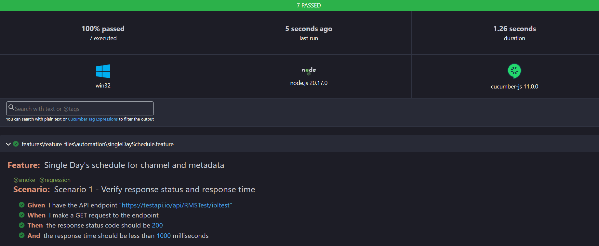

# API Automation with JavaScript Cucumber

A JavaScript-based API testing framework using Cucumber.js for behavior-driven development (BDD), integrated with various reporting tools.

## Table of Contents

- [Project Overview](#project-overview)
- [Features](#features)
- [Installation](#installation)
- [Usage](#usage)
- [Configuration](#configuration)
- [Running Tests](#running-tests)
- [Reporting](#reporting)
- [Logs](#logs)
- [Contributing](#contributing)
- [Contact](#contact)

## Project Overview

This project provides a framework for API testing using JavaScript, Cucumber.js, and Chai. It includes cucumber reporting for html and json based test reports.

## Features

- BDD-style API testing with Cucumber to engage non-technical stakeholders to contribute
- Cucumber html reports for easy test summary view and supporting json reports for future use with third party reporting libs
- Logging implemented
- Custom scipts to execute tests of specific category
- Provision to execute test cases with retry mechanism for the failed test cases
- Parallel running of tests supported
- Useful assertions implemented
- HTTP requests handled by Axios
- Maintenance of manual test cases within the framework 

## Technology stack

- Framework - Cucumber BDD
- Language - Javascript
- API automation - Axios lib
- Assertions - chai lib
- Logging - Winston lib
- Reporting - cucumber-html-reporter lib

## Installation

To get started, clone the repository and install the necessary dependencies:

```bash
git clone https://github.com/rohitmanekar/api-javascript-cucumber.git
cd api-javascript-cucumber
npm install
```

## Usage
### Writing Tests
Tests are written in Gherkin syntax and placed in the features directory. Step definitions are implemented in the features/step_definitions directory.

### Running Tests
To run the tests, use the following command:
```bash
npm run regression #for running regression scripts
npm run regressionWithRetry #for running regression scripts with retry mechanism for failed test cases
npm run fieldValidations #for running field validation scripts
npm run errorValidations #for running error validation scripts
npm run allScenarios #for running all scripts
npm run parallelScenarios #for running all scripts in parallel
OR
npx cucumber-js #for running all scenarios without script-help
```
## Configuration
The configuration for the test framework and reporting tools is located in the cucumber.js file. 

## Reporting
Test reports are generated using Cucumber Reports in html and json formats. The reports are generated in the reports directory.

### Generating Reports
To generate reports, run your tests as usual. The report generation is handled automatically after the tests complete.

### Viewing Reports
Copy the path of the cucumber html report and open in any browser to view the report. Below is the sample format of the cucumber html report:


## Logs
Logs are generated for every run of the tests in the app.log file in the logs directory.

## Contributing
Contributions are welcome! Please fork the repository, make your changes, and submit a pull request. Ensure that you follow the project's coding standards and include tests for any new features.

## Contact
For any questions or issues, please contact rohitmanekar.work@gmail.com
